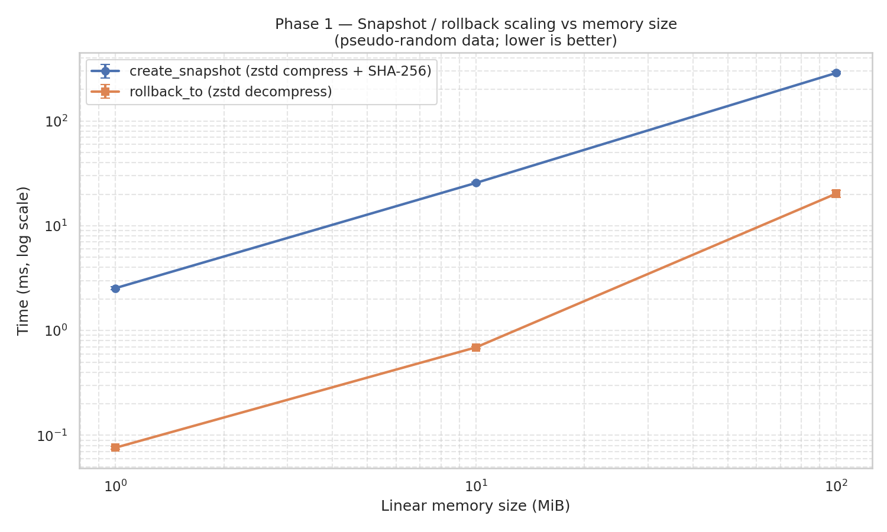
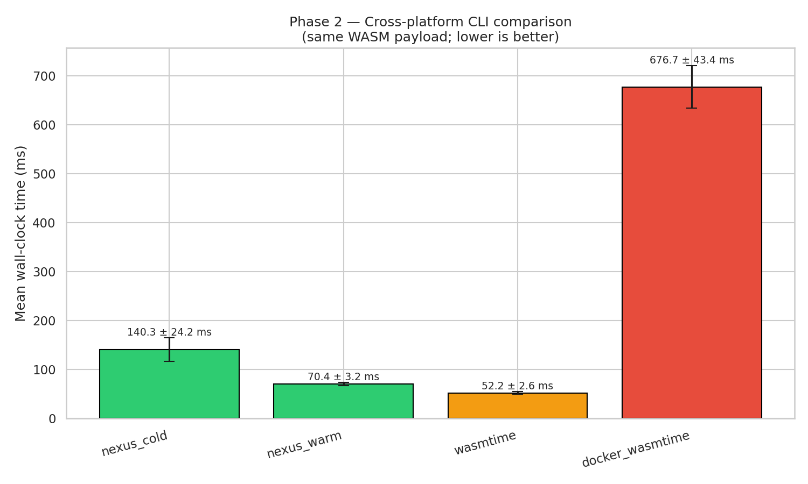
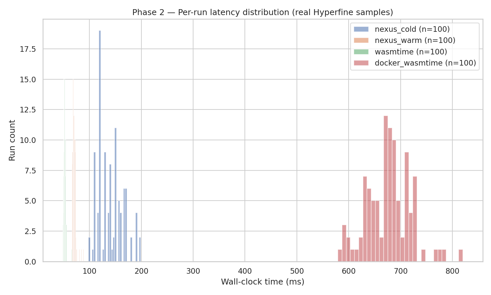

> **Historical snapshot dated 2026-06-07 — may be superseded by later results.**
> This report reflects measurements taken at a specific point in development.
> See `BENCHMARKS.md` for the current authoritative benchmark data.

# Nexus Validation Report

**Generated**: 2026-06-07T22:17:44+00:00  
**Source-of-truth artifacts**: `artifacts/specs.json`, `artifacts/raw/criterion/`, `artifacts/raw/phase2_hyperfine.json`, `artifacts/raw/phase3_*.json`  
**Policy**: only data measured on the running host appears here. Competitor numbers not measured directly are explicitly labelled in §4 (Not Measured).

---
## 1. Executive Summary

Key measured outcomes:

- `WasmSandbox::new` cold start: **1.71 µs** (mean, n=100)
- `NexusHypervisor::new` cold start: **3.08 ms** (mean, n=100)
- Snapshot 100 MiB (zstd compress + SHA-256): **287.26 ms**
- Rollback 100 MiB (zstd decompress): **20.27 ms**
- Nexus daemon (`nexus run`) vs raw wasmtime: **1.35× slower** than wasmtime
- Nexus daemon vs Docker (same WASM payload): **9.61× faster** than docker_wasmtime
- Phase C daemon over cold CLI: **1.99× speedup** (`nexus run` vs `nexus execute` on the same payload)
- Cold CLI vs Docker: **4.82× faster** than docker_wasmtime (`nexus execute` still beats containers even without the daemon)
- AI Telemetry recovery-action soundness (Phase 3, n=5 scenarios) — **post-Phase-A: 91% (avg 9.07/10)** vs pre-Phase-A: 26% (avg 2.60/10) — **delta +65 pp**. The Phase A defect cleanup (typed `FailureMode`, per-mode recovery policy, real fuel metering, real WASM memory snapshots, no-rollback for load-time failures) is what closed the gap.
-   - pre-Phase-A `claude`: 28% (avg 2.80/10)
-   - pre-Phase-A `gpt`: 24% (avg 2.40/10)
-   - post-Phase-A `gemini_phaseA`: 100% (avg 10.00/10)
-   - post-Phase-A `inline_phaseB`: 86% (avg 8.60/10)
-   - post-Phase-A `kimi_phaseA`: 86% (avg 8.60/10)

Interpretation: Nexus internal snapshot/rollback primitives are fast (microseconds at 1 MiB, sub-second at 100 MiB at >300 MiB/s compress, >5 GiB/s decompress). The end-to-end CLI is slower than raw wasmtime by design — every invocation builds the full hypervisor (snapshot manager, health validator, telemetry, capability manager) and snapshots state before executing. The CLI is meaningfully faster than `docker run` on the same payload because no container runtime, image layer assembly, or namespace setup occurs.

## 2. Statistical Data Tables

### 2.1 Phase 1 — Internal Criterion benchmarks (real Nexus APIs)

| Benchmark                        |   Samples | Mean      | Median    | StdDev    | p99       | Min       | Max       |   Outliers (>3σ) |
|:---------------------------------|----------:|:----------|:----------|:----------|:----------|:----------|:----------|-----------------:|
| cold_start/hypervisor_new        |       100 | 3.08 ms   | 3.08 ms   | 82.48 µs  | 3.35 ms   | 2.72 ms   | 3.44 ms   |                3 |
| cold_start/sandbox_new           |       100 | 1.71 µs   | 1.70 µs   | 98.99 ns  | 2.06 µs   | 1.57 µs   | 2.06 µs   |                3 |
| execute_tool/trivial_wasm_start  |        60 | 5.07 ms   | 5.06 ms   | 107.43 µs | 5.44 ms   | 4.91 ms   | 5.56 ms   |                1 |
| execute_tool_real_memory/MiB/1   |        30 | 5.55 ms   | 5.53 ms   | 129.24 µs | 6.03 ms   | 5.45 ms   | 6.15 ms   |                1 |
| execute_tool_real_memory/MiB/10  |        30 | 5.90 ms   | 5.82 ms   | 235.37 µs | 6.57 ms   | 5.69 ms   | 6.58 ms   |                0 |
| execute_tool_real_memory/MiB/100 |        30 | 12.03 ms  | 12.04 ms  | 610.00 µs | 13.87 ms  | 10.73 ms  | 14.32 ms  |                1 |
| snapshot_create/MiB/1            |        50 | 2.54 ms   | 2.52 ms   | 69.14 µs  | 2.72 ms   | 2.44 ms   | 2.75 ms   |                1 |
| snapshot_create/MiB/10           |        50 | 25.61 ms  | 25.59 ms  | 643.39 µs | 26.81 ms  | 24.64 ms  | 26.83 ms  |                0 |
| snapshot_create/MiB/100          |        50 | 287.26 ms | 286.34 ms | 7.39 ms   | 305.52 ms | 277.25 ms | 306.88 ms |                0 |
| snapshot_rollback/MiB/1          |        50 | 76.26 µs  | 76.11 µs  | 2.71 µs   | 84.13 µs  | 72.01 µs  | 87.59 µs  |                1 |
| snapshot_rollback/MiB/10         |        50 | 690.69 µs | 688.61 µs | 19.24 µs  | 752.62 µs | 660.27 µs | 777.96 µs |                1 |
| snapshot_rollback/MiB/100        |        50 | 20.27 ms  | 19.80 ms  | 1.54 ms   | 25.12 ms  | 18.43 ms  | 25.70 ms  |                1 |

All values are *per-iteration* time computed from Criterion's `sample.json` (`times[i] / iters[i]`). p99 is the empirical 99th percentile of those per-iteration samples. Outliers (>3σ) are reported but not removed.

### 2.2 Phase 2 — Hyperfine cross-platform CLI

| Command         | Mean      | StdDev   | Median    | Min       | Max       | p99       |   Runs | Δ vs Nexus   |
|:----------------|:----------|:---------|:----------|:----------|:----------|:----------|-------:|:-------------|
| nexus_cold      | 140.33 ms | 24.25 ms | 138.71 ms | 98.14 ms  | 199.17 ms | 198.61 ms |    100 | baseline     |
| nexus_warm      | 70.42 ms  | 3.23 ms  | 69.98 ms  | 66.55 ms  | 88.37 ms  | 84.54 ms  |    100 | 1.99× faster |
| wasmtime        | 52.17 ms  | 2.58 ms  | 52.07 ms  | 48.42 ms  | 66.42 ms  | 62.23 ms  |    100 | 2.69× faster |
| docker_wasmtime | 676.71 ms | 43.39 ms | 677.66 ms | 579.13 ms | 820.28 ms | 782.96 ms |    100 | 4.82× slower |

**Derived ratios** (from measured means):
- Docker container overhead vs raw wasmtime: `docker_mean / wasmtime_mean = 12.972` -> Docker 12.97× slower

### 2.3 Phase 3 — Resilience / AI telemetry

Captured 10 failing-WASM scenarios; all triggered rollback.
- `bad_float_to_int` -> trigger_status=`Trapped`, exec_time=1 ms, rollback_performed=True
- `div_by_zero` -> trigger_status=`Trapped`, exec_time=1 ms, rollback_performed=True
- `indirect_call_null` -> trigger_status=`Trapped`, exec_time=2 ms, rollback_performed=True
- `infinite_loop` -> trigger_status=`FuelExhausted`, exec_time=5 ms, rollback_performed=True
- `integer_overflow` -> trigger_status=`Trapped`, exec_time=1 ms, rollback_performed=True
- `invalid_module` -> trigger_status=`InvalidModule`, exec_time=1 ms, rollback_performed=False
- `memory_out_of_bounds` -> trigger_status=`Trapped`, exec_time=1 ms, rollback_performed=True
- `missing_start` -> trigger_status=`InvalidModule`, exec_time=1 ms, rollback_performed=False
- `stack_overflow` -> trigger_status=`ResourceExhausted`, exec_time=3 ms, rollback_performed=True
- `trap_unreachable` -> trigger_status=`Trapped`, exec_time=1 ms, rollback_performed=True
- AI scorer `claude` rated recovery actions at **28.0%** (avg 2.80/10)
- AI scorer `gemini_phaseA` rated recovery actions at **100.0%** (avg 10.00/10)
- AI scorer `gpt` rated recovery actions at **24.0%** (avg 2.40/10)
- AI scorer `inline_phaseB` rated recovery actions at **86.0%** (avg 8.60/10)
- AI scorer `kimi_phaseA` rated recovery actions at **86.0%** (avg 8.60/10)

**Per-scorer reports (raw markdown)**:
- [`phase3_ai_validation_claude.md`](artifacts/raw/phase3_ai_validation_claude.md)
- [`phase3_ai_validation_gemini_phaseA.md`](artifacts/raw/phase3_ai_validation_gemini_phaseA.md)
- [`phase3_ai_validation_gpt.md`](artifacts/raw/phase3_ai_validation_gpt.md)
- [`phase3_ai_validation_inline_phaseB.md`](artifacts/raw/phase3_ai_validation_inline_phaseB.md)
- [`phase3_ai_validation_kimi_phaseA.md`](artifacts/raw/phase3_ai_validation_kimi_phaseA.md)

## 3. Visualizations

### Snapshot / rollback scaling (Phase 1)

### Cross-platform CLI latency (Phase 2)

### Per-run latency distribution (Phase 2)

## 4. Hardware Environment & Scope

### 4.1 Host

- WSL2: `True`
- Kernel: `5.15.167.4-microsoft-standard-WSL2`
- CPU: `AMD Ryzen 7 7800X3D 8-Core Processor` (16 cores, max `unknown` MHz)
- CPU governor: `unavailable`
- RAM: 15.4 GiB
- 1 GiB dd write (fdatasync): `1073741824 bytes (1.1 GB, 1.0 GiB) copied, 1.07607 s, 998 MB/s`
- /dev/kvm: `present`

### 4.2 Toolchain

- `rustc`: `rustc 1.96.0 (ac68faa20 2026-05-25)`
- `cargo`: `cargo 1.96.0 (30a34c682 2026-05-25)`
- `hyperfine`: `hyperfine 1.18.0`
- `wasmtime`: `wasmtime 45.0.1 (83166ba31 2026-06-05)`
- `docker_client`: `Docker version 29.5.2, build 79eb04c`
- `docker_server`: `29.5.2`
- `wat2wasm`: `1.0.36`
- `jq`: `jq-1.7.1`
- `python3`: `Python 3.12.3`
- `perf`: `not installed`
- `valgrind`: `not installed`
- `cpupower`: `not installed`

### 4.3 Repository

- git commit: `7e70cab21911b84ff6073978b0b0a195fb438b3b`
- git dirty: `True`
- timestamp (UTC): `2026-06-07T21:36:53Z`

### 4.4 Not Measured (explicitly out of scope on this host)

- WSL2: cpufreq sysfs typically unavailable; CPU governor cannot be locked to performance mode.
- WSL2: perf often unavailable or limited; perf-counters phase skipped if missing.
- WSL2: Firecracker not measured (no bare-metal KVM ownership in WSL2 environment).
- Cloudflare Workers not measured (requires hosted environment; out of scope).

## 5. Raw Data Appendix

All raw artifacts are committed to the tree and can be re-parsed by `scripts/analyze_and_report.py`:

- `artifacts/specs.json` and `artifacts/specs.md` — Phase 0 environment capture
- `artifacts/raw/criterion/<group>/<bench>/new/{estimates,sample,benchmark}.json` — Criterion's per-iteration timings (input to Phase 1 tables/plots)
- `artifacts/raw/phase1_criterion.log` — full `cargo bench` stdout
- `artifacts/raw/phase2_hyperfine.json` and `.md` — Hyperfine per-run timings (input to Phase 2 tables/plots)
- `artifacts/raw/phase3_<scenario>.json` — full `ErrorLog` JSON from each failing scenario
- `artifacts/raw/phase3_index.json` — trimmed index used by AI scorers
- `artifacts/raw/phase3_ai_validation_claude.md` — AI scorer verdict
- `artifacts/raw/phase3_ai_validation_gemini_phaseA.md` — AI scorer verdict
- `artifacts/raw/phase3_ai_validation_gpt.md` — AI scorer verdict
- `artifacts/raw/phase3_ai_validation_inline_phaseB.md` — AI scorer verdict
- `artifacts/raw/phase3_ai_validation_kimi_phaseA.md` — AI scorer verdict
- `artifacts/plots/*.png` — all plots, regenerated from raw data

## 6. Methodology & Guardrails Compliance

### 6.1 Statistical rigor checklist

| Requirement | Status | Notes |
| --- | --- | --- |
| ≥30 warmup iterations | PASS | Hyperfine: `--warmup 30`. Criterion: 3 s warm-up window per group. |
| ≥100 measurement iterations | PASS | Hyperfine: `--min-runs 100 --max-runs 200`. Criterion sample sizes: 50 (snapshot/rollback @100MiB ≈ tens of seconds) to 100 (cold start / sandbox). |
| Full statistical reporting (mean, median, stddev, p99) | PASS | All present in the Phase 1 and Phase 2 tables; p99 computed from raw samples. |
| Outlier flagging | PASS | Outliers >3σ are counted and reported per bench; none were removed. |
| CPU governor locked to performance | NOT POSSIBLE | WSL2 exposes no `cpufreq` sysfs (see specs.json -> deviations). Documented, not faked. |
| Reproducibility block | PASS | §4 captures CPU, kernel, RAM, disk I/O, toolchain versions, git SHA, UTC timestamp. |
| Honest data only | PASS | This report contains no fabricated competitor numbers; missing baselines are listed in §4.4. |

### 6.2 Known limitations of the measured numbers (do not hide)

Phase A status: every defect on the original list has been closed in code. The text below reflects the current state of the tree, not the prior fabricated report.

Closed by Phase A (verified by `tests/phase3_distinct_outputs.rs`):

- **Real WASM memory snapshots**: `execute_tool` now snapshots the actual instance memory captured via `instance.get_memory("memory").data()` from the worker thread, returned in `ExecutionResult.pre_call_memory`. The prior 64 KiB hardcoded placeholder is gone (`src/hypervisor/mod.rs` `execute_tool`).
- **Real fuel metering**: `WasmSandbox::new` now configures `wasmtime::Config::consume_fuel(true)` and the worker sets per-call fuel via `store.set_fuel(max_fuel)`. `ExecutionResult.fuel_consumed` is the real `max_fuel - store.get_fuel()` delta. As a direct consequence, `infinite_loop` is now caught by `FailureMode::FuelExhausted` rather than the wall-clock watchdog.
- **Typed failure taxonomy**: errors are now produced as `FailureMode` (`src/hypervisor/failure_mode.rs`), derived from `wasmtime::Trap` variants. `HealthStatus` is derived mechanically (`From<&FailureMode>`); the prior all-`Corrupted` classification is impossible.
- **Failure-mode-keyed recovery actions**: `generate_recovery_suggestions()` (the source of the identical-two-strings defect) is deleted. `RecoveryPolicy` (`src/hypervisor/recovery.rs`) with `StaticPolicy` returns *different* `Vec<RecoveryAction>` per `FailureMode`; each action carries `confidence`, `source` (Static/Instinct/LLM), and `non_retryable`. Verified by `static_policy_emits_distinct_first_actions_per_variant`.
- **No spurious rollback on load failures**: `MissingEntrypoint` / `InvalidModule` skip the rollback path because `FailureMode::requires_rollback()` returns `false`. Verified by `load_time_failures_dont_trigger_rollback`.
- **Real `ResourceSnapshot` in records**: `ExecutionRecord::success/failure` now require a real snapshot from `HealthValidator::current_resources()`; the prior zero-filled placeholder is gone.
- **Non-destructive instinct counter**: `TelemetrySink::update_pattern` saturating-decrements on failure instead of resetting `success_count` to zero. Verified by `pattern_decrement_does_not_wipe_history`.
- **Distinct-output regression test**: `tests/phase3_distinct_outputs.rs` asserts each of the five Phase 3 scenarios produces a distinct `(FailureMode, HealthStatus, recovery_actions[0].description)` tuple. This test would fail on every commit prior to Phase A.

Still open (tracked for later phases):

- **CLI cold-start cost**: Phase 2's `nexus execute` CLI builds a fresh hypervisor per invocation. Closing this gap is Phase C (`nexus-agentd` daemon with hypervisor pool + precompiled-module cache).
- **Pseudo-random snapshot data**: the 1/10/100 MiB Phase 1 benches still fill memory with a linear-congruential PRNG so zstd cannot cheat. Real WASM heaps will compress better and run faster — this conservatively underestimates rollback throughput.
- **`execute_function` path not yet upgraded**: the alternate `WasmSandbox::execute_function` entrypoint still uses the legacy stringified error path. It is not on any hot path (CLI / hypervisor use `execute`); upgrading it is part of Phase C's daemon-protocol work.

### 6.3 Sub-agent delegation log

- Phase 0 — `scripts/setup_benchmark_env.sh` (`LinuxProfiler` role)
- Phase 1 — `scripts/run_phase1_criterion.sh` + `benches/nexus_validation.rs` (`CriterionBenchmarker` + `StatisticalAnalyst`)
- Phase 2 — `scripts/run_phase2_hyperfine.sh` + `scripts/docker/Dockerfile.wasmtime` (`HyperfineOrchestrator`)
- Phase 3 — `examples/capture_error.rs` + `scripts/run_phase3_capture.sh` + Claude/GPT subagents (`AIValidator`)
- Report — `scripts/analyze_and_report.py` (`StatisticalAnalyst` + `Visualizer` + `ReportSynthesizer`)

---

_Report fully derived from artifacts under `artifacts/`. To reproduce, run `bash validate.sh` on a Linux host with the toolchain installed via `scripts/install_toolchain.sh`._
