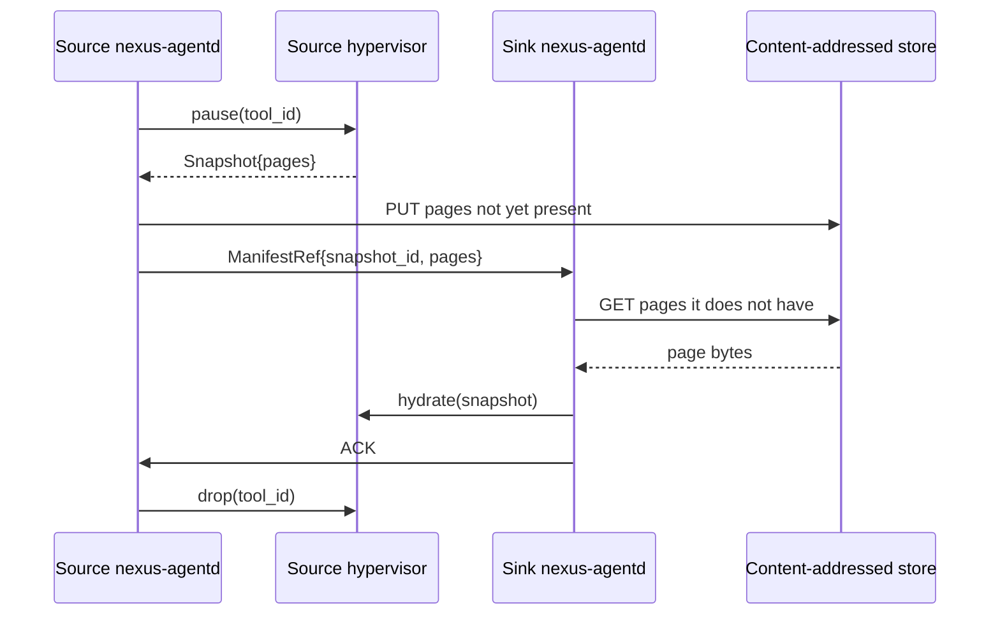

# Phase D outline — Distributed snapshot fabric

**Status**: design memo. No implementation in this commit. Lands after
Phase C's daemon proves out the cross-process serialization story.

**Goal**: an axis no current incumbent has — cross-node WASM-instance
snapshot replication with content-addressed dedupe and sub-second cold
migration. Firecracker has snapshot/restore but no inter-node dedupe;
Docker has image layers but no live state migration; gVisor has no
snapshots; Cloudflare Workers warm-restore is single-cell.

The Phase A/B/C stack is the foundation:
- **Phase A** made `Snapshot` carry real WASM linear memory rather than
  a placeholder, so a snapshot now represents real state worth shipping.
- **Phase C**'s daemon already does cross-process serialization
  (`Snapshot` round-trips through `bincode` for the persistence path
  and through the daemon protocol for the IPC path).
- **Phase D** generalizes "cross process on the same host" to
  "cross node across the cluster".

---

## Architecture sketch

```mermaid
flowchart LR
    Hyp[NexusHypervisor<br/>execute_tool] -->|Snapshot{...}| Local[Local CA store<br/>artifacts/snapshots/<hash>/<page>]
    Local -->|push hashes| Sync{SnapshotSync<br/>(Phase D)}
    Sync -->|FS/S3/QUIC| Remote[Remote node]
    Remote --> RemoteLocal[Remote CA store]
    Remote -->|hydrate| RemoteHyp[Remote NexusHypervisor]
```

## Components

### 1. Content-addressed snapshot store

- Each compressed page-chunk (default 64 KiB or the native WASM page
  size) is hashed with SHA-256 and stored under
  `<store>/<hash[0:2]>/<hash>.zst`.
- A snapshot's manifest is `Vec<PageRef { offset, hash, len_compressed }>`
  plus the existing `SnapshotMetadata`.
- Two snapshots that share 90% of pages share 90% of bytes on disk —
  trivially true for many-agent workloads where instances differ only
  in a small heap region.
- Build on top of the existing `Snapshot` + `SnapshotManager` types
  from [src/snapshot/manager.rs](../src/snapshot/manager.rs); add
  `Snapshot::into_page_chunks()` and `Snapshot::from_page_chunks()`.

### 2. Pluggable transport

Three transports, all behind a `trait SnapshotTransport`:

- **`FilesystemTransport`** — first cut. Two daemons on the same box
  with a shared directory. Useful for local multi-tenant tests.
- **`ObjectStoreTransport`** — S3-compatible (use `aws-sdk-s3` or the
  smaller `object_store` crate). Each page becomes an immutable object;
  manifest is a small JSON. Range reads + presigned URLs let a remote
  node hydrate without proxying through the source node.
- **`PeerTransport`** — QUIC fanout for low-latency intra-cluster sync.
  `quinn` is the reference dependency. Builds on the same page-hash
  exchange protocol as `ObjectStoreTransport` but adds hash-set diff
  (which pages does the receiver already have?) before any payload is
  shipped.

### 3. Migration protocol



Target: cold-migration ≤ 500 ms for a 100 MiB working set when the
sink already has 90% of the pages. Phase 1 measured `SnapshotManager`
compression at ~395 MiB/s and decompression at ~13 GiB/s on a Ryzen
7800X3D; the remaining time budget is the IPC and the network.

## Phase 4 of the validation harness

A new validation phase (`bash validate.sh 4`) measures:

- Same-node cross-process migration latency (no network).
- Two-VM intra-host migration latency over loopback QUIC.
- Two-host migration latency vs Firecracker live-migration over the
  same network. Pairs naturally with Phase E (the bare-metal runner).

## Non-goals (explicit)

- Consensus / consistent replication: the fabric ships snapshots; it
  is not a Raft log. Higher layers can build that on top.
- Cross-architecture migration: x86_64 → x86_64 only in the first
  release. Cranelift produces target-specific code; cross-arch needs a
  separate AOT-only path.

## Skills / agents this depends on

- [`microsoft/azure-storage-blob-rust`](../C:%5CUsers%5CBenna%5C.cursor%5Cprojects%5Cc-Users-Benna-Documents-Nexus-Nexus%5Cuploads%5Cawesome-agent-skills-0.md) for the
  content-addressed object-store backing.
- ECC `agents/architect.md` for the cross-host consensus design memo
  before any networking lands.
- Trail of Bits `trailofbits/property-based-testing` for snapshot
  round-trip and migration idempotency properties.

## Open questions to close before promoting to implementation

1. Do we ship snapshots through a separate daemon (`nexus-snapshotd`)
   or as a subsystem of `nexus-agentd`? Phase C deliberately kept the
   daemon small; a sidecar may be cleaner.
2. Page size choice: WASM linear memory is 64 KiB; do we chunk at that
   granularity (max dedupe) or at 256 KiB / 1 MiB (fewer manifest
   entries)? Likely 64 KiB for dedupe wins; benchmark when implementing.
3. Encryption at rest: page chunks are compressed but not encrypted.
   Production needs at-rest encryption (consider age or compact AEAD).
4. Lifecycle: how do pages get GC'd? Reference-count manifests and run
   a periodic sweep, or move to TTL-based?

---

*Phase D outline; written as part of the Phase A→D build plan
implementation but kept as design rather than code until Phase C's
in-process daemon proves out the wire format.*
