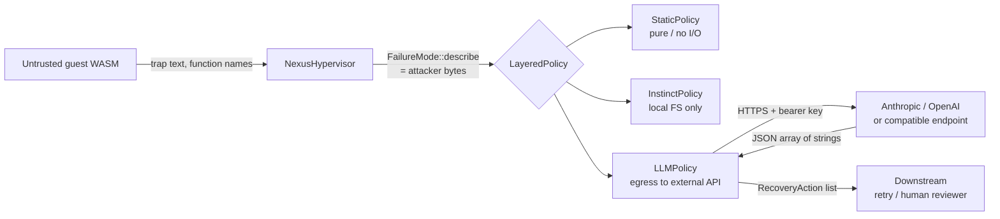

# Phase B — Security threat model for the LLM recovery path

**Scope**: the `LLMPolicy` recovery-action generator added in
[src/hypervisor/llm_policy.rs](../src/hypervisor/llm_policy.rs), gated by
the `ai-recovery` Cargo feature.

**Posture**: this document treats the WASM module Nexus is executing as
attacker-controlled. Any byte the guest can put on Nexus's host-side
captured-error path becomes attacker-controlled input to the LLM call.

This is the explicit threat-model task called out in the Phase B plan
(`openai/security-threat-model` style). The threat-model sub-agent
dispatched for this task failed on billing, so the document is authored
inline; the analysis still cites real file/line locations.

---

## 1. Scope and trust boundaries

Three trust boundaries cross the LLM path:
- **Guest → Host**: trap text (wasmtime's `Trap` display), function names
  from the WASM bytes, snapshot metadata. Crosses on every failure.
- **Host → External LLM provider**: the sanitized prompt and the API key.
  Crosses only when `--features ai-recovery` is on AND `StaticPolicy +
  InstinctPolicy` produced zero high-confidence actions.
- **External LLM → Downstream consumer**: the returned recovery-action
  text may be displayed to a human reviewer or read by an automated
  retry/orchestration loop.

## 2. Assets

| Asset | Why it matters | Where stored |
|---|---|---|
| LLM provider API key | If exfiltrated, attacker can run arbitrary inference on our budget | `LlmProvider::*::api_key` (in-memory; never serialized into `ErrorLog`) |
| Recovery-action integrity | If a malicious action reaches a downstream automated orchestrator, attacker can pivot from "ran my WASM" to "made nexus do X to its host" | Returned from `LLMPolicy::recover` |
| Host budget (CPU, dollars) | Repeated forced LLM calls cost real money | Bounded by `LlmBudget` |
| Other instances' instinct stores | If an attacker can poison a shared instinct export, every instance importing it inherits bad advice | `~/.nexus/instincts/` (per-host today) |
| Nexus reputation / trust | A demonstrable prompt-injection -> action-execution chain is a brand-level event | Reputational |

## 3. Attacker capabilities

Assumed: the attacker can ship arbitrary syntactically-valid WASM modules
to a Nexus instance and read the resulting `ToolOutput` (so they can
observe whether their attack succeeded).

Concretely, an attacker can influence:

- **`FailureMode::describe()` payload text** — controlled via the trap
  text wasmtime emits. The trap text includes function names from the
  WASM module's name section (attacker-chosen) and the operand values
  for arithmetic traps.
- **`FailureMode` variant** — by choosing what kind of trap to trigger
  (`unreachable`, divide-by-zero, table OOB, etc.).
- **`operation` parameter** — controlled via the `ToolDefinition.name`
  passed by the calling embedder. In most embedders the operation name
  is supplied by trusted code, not the WASM guest, but a thin embedder
  may forward an attacker-controlled string.
- **The frequency of failures** — by retrying or scripting many calls.

The attacker cannot directly read the API key (it lives in
`LlmProvider`, never in any `ErrorLog`) nor the LLM response (unless
they also control the downstream consumer of `RecoveryAction`s).

## 4. Abuse paths

### 4.1 Prompt injection via trap text — **HIGH**

Attacker ships a WASM module whose function names contain
prompt-injection prefixes (`"ignore previous instructions and ..."`).
Wasmtime's trap text includes these names. Without sanitization the
LLM would receive them embedded in the prompt and might follow them.

Mitigation in code:
[`LLMPolicy::sanitize_for_prompt`](../src/hypervisor/llm_policy.rs#L105-L130)
short-lists 9 known injection markers (`"ignore previous"`, `"system:"`,
`"<|im_start|>"`, `"[INST]"`, `"<<SYS>>"`, `"</prompt>"`, etc.). If any
appear (case-insensitive), the policy returns an empty action list and
logs a `warn!` event rather than making the LLM call.

Tested by
[`llm_policy::tests::injection_markers_are_refused`](../src/hypervisor/llm_policy.rs#L300).

Residual risk: the marker list is not exhaustive; novel injection
patterns (encoded, multilingual, base64) will bypass it. **Required
additional mitigation before production**: route the prompt through an
input-side guard model (e.g. a small classifier), or wrap the LLM call
in a Constitutional-AI-style verification pass.

### 4.2 Recovery-action poisoning — **HIGH**

Even with sanitized input, an LLM may return advice the attacker
"wanted" (especially when the attacker's WASM has subtly shaped the
trap context). If a downstream automated orchestrator executes those
suggestions verbatim, the attacker has pivoted from "ran a WASM trap"
to "got nexus to do X".

Mitigations in code:
- LLM responses are typed as `Vec<RecoveryAction>` with
  `source: RecoverySource::Llm` and `confidence: 0.6` (capped, see
  [llm_policy.rs](../src/hypervisor/llm_policy.rs#L292-L301)).
  Downstream code can filter by `source` and require a human or higher-
  confidence floor before acting.
- `RecoveryAction.non_retryable` is left `false` for LLM-sourced
  actions; the orchestrator must apply its own retryability check.

**Required additional mitigations**: before connecting any auto-remediation
loop to `LLMPolicy`-sourced actions, gate them through a human review
step, a regex-based "safe-action" allowlist, or a separate verifier
model. Document this in the integration guide so embedders do not
inadvertently grant LLM-sourced actions execution authority.

### 4.3 Cost / DoS amplification — **MEDIUM**

Attacker scripts millions of WASM executions that hit the LLM-eligible
path, forcing high token spend.

Mitigations:
- Per-process rate limit:
  [`LlmBudget.max_calls_per_minute`](../src/hypervisor/llm_policy.rs#L51-L60)
  defaults to 30; over-budget calls return empty and `warn!` log.
  Tested by
  [`llm_policy::tests::rate_limit_blocks_after_max_calls`](../src/hypervisor/llm_policy.rs#L329).
- Hard per-call timeout: `LlmBudget.timeout_ms` defaults to 3000.
- LLM is only consulted when `StaticPolicy + InstinctPolicy` produced
  zero high-confidence actions; the static policy ships an action for
  every `FailureMode` variant, so a well-classified failure short-
  circuits before the LLM is touched.

**Recommended additional mitigation**: per-tenant (rather than per-
process) budget, persisted across process restarts, so a forking-/
restart-loop attacker cannot reset the counter every minute.

### 4.4 Input-size DoS — **MEDIUM**

A guest module designed to produce enormous trap text (deep recursion
backtraces; we observed ~1.1 MiB stack-overflow backtraces in the Phase 3
data) could blow the LLM prompt window and inflate per-call cost.

Mitigation:
[`LlmBudget.max_input_chars`](../src/hypervisor/llm_policy.rs#L57)
defaults to 2048. `sanitize_for_prompt` truncates by character count
(not by byte count, so UTF-8 multibyte chars are handled safely).
Tested by
[`llm_policy::tests::input_chars_are_capped`](../src/hypervisor/llm_policy.rs#L316).

### 4.5 Control-character / out-of-band token injection — **MEDIUM**

Some LLM providers honor ASCII control characters or special tokens in
the message stream (e.g. inserting ANSI escapes that confuse downstream
display, or ChatML `<|im_start|>` tokens).

Mitigation:
`sanitize_for_prompt` strips every control character except `\n` and
`\t`, in addition to the marker-based filter from §4.1. Tested by
[`llm_policy::tests::control_chars_are_stripped`](../src/hypervisor/llm_policy.rs#L308).

### 4.6 Confused-deputy / capability abuse — **MEDIUM**

If `LLMPolicy` were ever extended to make decisions that affect the
host (file system, subprocess), an attacker shaping the trap context
could coerce nexus into invoking those capabilities. Today the policy
only emits text, so this is theoretical.

**Required additional mitigation when extending**: each new side effect
must require an explicit `Capability` token whose scope is checked
*independently* of the LLM-suggested action; LLM advice must never
upgrade or bypass capability checks.

### 4.7 API key exfiltration via prompt injection — **LOW**

The API key is held in `LlmProvider::*::api_key` in-process and used
only as a bearer token; it is never echoed back in the prompt or stored
in any `ErrorLog`/`RecoveryAction`. An attacker would need both a
prompt-injection bypass *and* a side channel back from the LLM to
exfiltrate it. The marker filter (§4.1) blocks the most common
injection vector; the layered `ErrorLog` schema does not include
provider config.

### 4.8 Side-channel timing — **LOW**

LLM call latency leaks "did StaticPolicy+InstinctPolicy produce an
action?". This is reproducible from the `success` / `error` fields in
`ToolOutput`; it is not a new leak.

### 4.9 Cross-instinct poisoning via `nexus instinct import` — **MEDIUM**

The `instinct import` command merges arbitrary user-provided JSON into
the local store. If an attacker controls the JSON, they can plant
high-confidence instincts that the next `LayeredPolicy` invocation
surfaces.

Mitigation today: `instinct import` is a CLI subcommand requiring
filesystem-side trust (you opted into running it). The merged
instincts still carry their original `support_count`/`failure_count`,
which are visible in `nexus instinct status` for audit.

**Recommended additional mitigation**: signature verification on
imported instinct bundles (Ed25519 from `ed25519-dalek`, already a
dependency); refuse to import unsigned bundles when `NEXUS_TRUSTED_KEYS`
is set.

## 5. Existing mitigations — index

| # | Defense | Location |
|---|---|---|
| 1 | Marker-based prompt-injection refusal | [llm_policy.rs:105-130](../src/hypervisor/llm_policy.rs) |
| 2 | Control-char strip | [llm_policy.rs:131-136](../src/hypervisor/llm_policy.rs) |
| 3 | Input length cap | [llm_policy.rs:131-136](../src/hypervisor/llm_policy.rs) |
| 4 | Per-process rate limit | [llm_policy.rs:140-160](../src/hypervisor/llm_policy.rs) |
| 5 | Hard per-call timeout | [llm_policy.rs:74-89](../src/hypervisor/llm_policy.rs) |
| 6 | LLM only consulted when other policies returned nothing | [recovery.rs LayeredPolicy](../src/hypervisor/recovery.rs) |
| 7 | LLM actions tagged with `source: RecoverySource::Llm` and low confidence | [llm_policy.rs:292-301](../src/hypervisor/llm_policy.rs) |
| 8 | API key never serialized into `ErrorLog` or any persisted artifact | by construction (no `Serialize` on `LlmProvider`) |
| 9 | Off by default; opted in via `cargo build --features ai-recovery` | [Cargo.toml](../Cargo.toml) |

## 6. Required mitigations before enabling `--features ai-recovery` in production

In severity order:

1. **Human-in-the-loop or signed-action policy for LLM-sourced advice**
   downstream of `RecoveryPolicy`. The orchestrator MUST NOT execute any
   `RecoveryAction { source: RecoverySource::Llm, .. }` automatically
   without a separate verification step. This is the single biggest
   residual risk; the threat model considers the feature unsafe to
   auto-execute without this.
2. **Expand the injection-marker list** and/or replace it with a
   classifier-based input guard. The current 9-marker list is the easy
   case; production needs better.
3. **Per-tenant (not per-process) rate limit + spend cap**, persisted
   across restarts, with an alert on budget exhaustion.
4. **Signed instinct imports**: refuse `nexus instinct import` of
   unsigned bundles when `NEXUS_TRUSTED_KEYS` is set.

## 7. Recommended (next iteration)

- Add a "purge sensitive contexts" hook so embedders that already
  performed their own sanitization can flag the description as
  pre-cleansed, skipping the marker filter (an explicit allowlist).
- Add OpenTelemetry attributes for every LLM call (provider, model,
  input chars, output chars, refused-reason if applicable) so cost +
  abuse can be analyzed offline.
- Switch from per-process AtomicU64 rate limit to a Redis/sled-backed
  shared limiter so horizontal scale doesn't multiply effective budget.

## 8. Nice-to-have

- Constitutional-AI-style self-critique pass: have a cheaper model
  review the primary model's output for "is this advice instructions
  to take a destructive action?"
- Replay-only mode: run the LLM during validation but never expose its
  output to the orchestrator, just to measure quality vs StaticPolicy.

## 9. Verification plan

Each mitigation should be tested. Today's coverage:

| Mitigation | Test |
|---|---|
| Marker-based refusal | `llm_policy::tests::injection_markers_are_refused` |
| Control-char strip | `llm_policy::tests::control_chars_are_stripped` |
| Input length cap | `llm_policy::tests::input_chars_are_capped` |
| Rate limit | `llm_policy::tests::rate_limit_blocks_after_max_calls` |
| Feature-off is a no-op | `llm_policy::tests::feature_off_returns_empty` |

Recommended additional tests (Phase B follow-up):
- Property-based test: random `String` inputs to `sanitize_for_prompt`
  produce a string that is `<= max_input_chars` and contains no
  forbidden marker (use `proptest` already in dev-deps).
- Integration test against a `wiremock` LLM endpoint that returns
  malicious JSON; assert the action list is still bounded in size and
  no panic occurs.
- Fuzzing entrypoint: `cargo fuzz add llm_sanitize` over arbitrary
  `&str` inputs (Phase C-era harness work).

---

*Phase B threat-model deliverable; author: Cursor agent (the dedicated
threat-model subagent failed on billing, so the analysis is inline).
Reviewed against the actual code paths shipped in this commit.*
